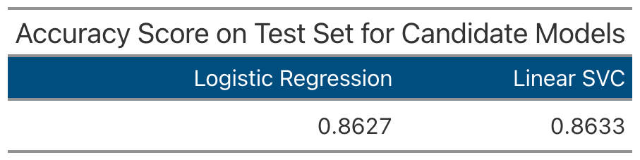
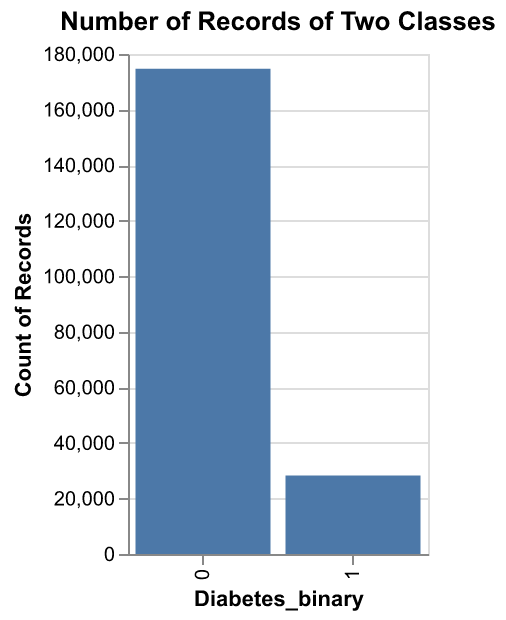
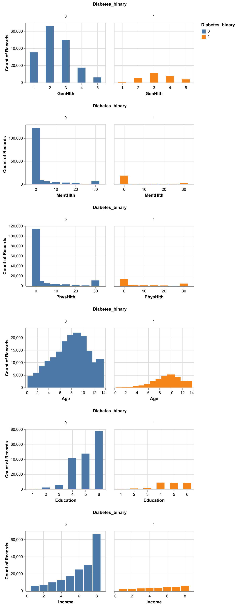
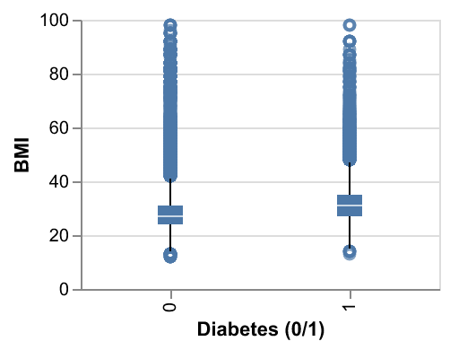
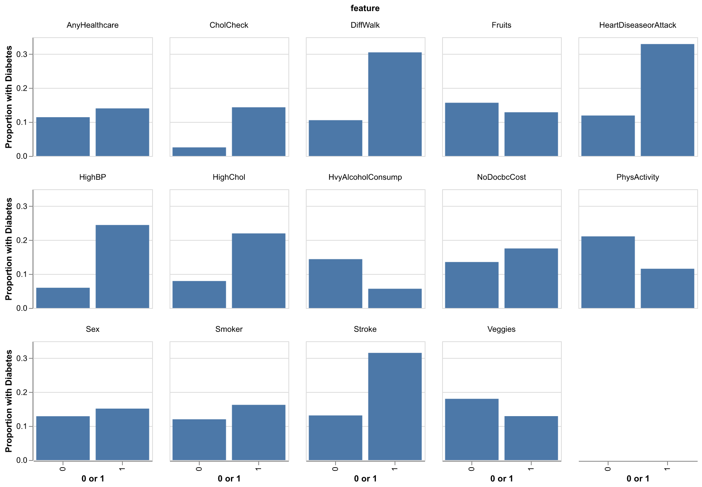
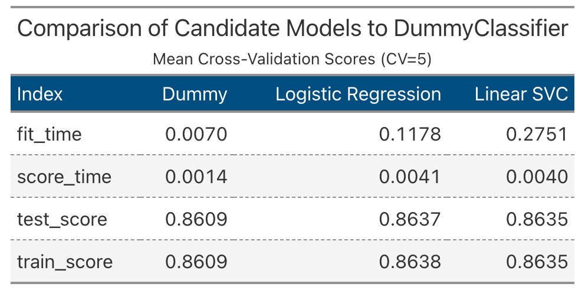

```{python}
import pandas as pd
import numpy as np
import pickle
from IPython.display import Markdown, display
from tabulate import tabulate
```

```{python}
#| echo: false
train_df = pd.read_csv("../src/objects/train_df.csv")
test_df = pd.read_csv("../src/objects/test_df.csv")
# =============================== to get the train, test %
n_train = train_df.shape[0]
n_test = test_df.shape[0]
r_train = n_train / (n_train + n_test)
r_test = 1 - r_train

n_features = train_df.shape[1] - 2 # -2 for ID column and target
```

```{python}
#| echo: false
train_score = pd.read_csv("../results/models/model_training.csv")
test_score = pd.read_csv("../results/models/model_testing.csv")
```


## Summary

This project attempts to predict diabetes status using the Logistic Regression and LinearSVC models, against a baseline DummyClassifier on an imbalanced dataset. All models achieved similar accuracy on the test set (approximately `{python} round(np.mean(test_score),2)`), which highlights a key issue: accuracy alone is not a reliable performance metric (see @fig-model_testing).

{#fig-model_testing width=60%}

These findings motivate deeper exploratory data analysis, evaluation with additional metrics (precision, recall, F1), and exploration of alternative models and threshold tuning to get a more robust assessment of the model's predictability. 

## Introduction

Diabetes is a chronic disease that prevents the body from properly controlling blood sugar levels, which can lead to serious health problems including heart disease, vision loss, kidney disease, and limb amputation [@Teboul2020]. Given the severity of the disease, early detection can allow people to make lifestyle changes and receive treatment that can slow disease progression. We believe that machine learning models using survey data can offer a promising way to create accessible, cost-effective screening tools to identify high-risk individuals and support public health efforts.

### Research Question
Can we use health indicators and lifestyle factors from the CDC's Behavioral Risk Factor Surveillance System [@CDC2015BRFSS] survey to accurately predict whether an individual has diabetes?

We are looking to:  
1. Build and evaluate classification models that predict diabetes status based on `{python} n_features` health and lifestyle features.  
2. Compare the performance and efficiency of logistic regression and support vector machine (SVM) classifiers.  
3. Assess whether survey-based features can provide sufficiently accurate predictions for practical screening applications.  


## Methods & Results

This analysis uses the diabetes_binary_health_indicators_BRFSS2015.csv dataset @tbl-df, a cleaned and preprocessed version of the CDC's 2015 Behavioral Risk Factor Surveillance System [@CDC2015BRFSS] survey data, made available by Alex Teboul on Kaggle [@Teboul2020].

```{python}
#| label: tbl-df
#| tbl-cap: Diabetes Data with Health Indicators and Lifestyle Factors
#| echo: false

# =============================== for presenting table.head
Markdown(train_df.head().to_markdown(index = False))
```

For this analysis, we split the dataset into training `{python} str(round(r_train * 100)) + "%"` and testing `{python} str(round(r_test * 100)) + "%"` sets using a fixed random state (522) to ensure reproducibility. We implemented two classification algorithms:

1. Logistic Regression: A linear model appropriate for binary classification that estimates the probability of diabetes based on a linear combination of features.
2. Linear Support Vector Classifier (SVC): A classifier that finds an optimal hyperplane to separate diabetic from non-diabetic individuals.

Both models were implemented using scikit-learn pipelines that include feature standardization (StandardScaler) to normalize the numeric features to comparable scales. Binary categorical features were already processed in the dataset and were set to pass through the column transformer. We evaluated model performance using cross-validation on the training set and final accuracy assessment on the held-out test set.

Our results show that both models achieve approximately `{python} str(round(np.mean(train_score.iloc[-2,1:]), 2) * 100) + "%"` accuracy, with logistic regression demonstrating slightly faster training time. 


## Discussion

The exploratory data analysis revealed several important patterns in the dataset. First, the target variable (diabetes_binary) is highly imbalanced  (see @fig-imb_class). This imbalance also appears across ordinal variables such as age, education, and income (see @fig-ordinal_bar).

{#fig-imb_class width=30%}

{#fig-ordinal_bar width=70%}


Additionally, individuals with diabetes (diabetes_binary = 1) tend to have higher BMI values on average (see @fig-numeric_box). 

{#fig-numeric_box width=30%}

Other binary health and lifestyle factors—such as high blood pressure, smoking status, and physical activity—also show clear differences between diabetic and non-diabetic groups (see @fig-binary_bar). 

{#fig-binary_bar width=80%}

Together, these patterns suggest that several features are related to diabetes status, but the dominance of the majority class may obscure these relationships when evaluating model performance.


The baseline DummyClassifier achieves an accuracy score of about `{python} round(train_score.iloc[-2,1],2)`, derived from assigning the most frequent class (non-diabetic) to all patients. This highlights how approximatey `{python} str(round(train_score.iloc[-2,1],2) * 100) + "%"` of the dataset is non-diabetic. Both Logistic Regression and LinearSVC achieve similar accuracy (approximately `{python} round(np.mean(train_score.iloc[-2,2:]), 2)`) with little to no improvement (see @fig-model_training).

{#fig-model_training width=60%}


As revealed from the exploratory data analysis, the class imbalanced problem may affect the models’ reliability. Therefore, more analysis is needed to explore additional models, check class balance with metrics such as precision and recall, examine confusion matrices, and test different data splits or tune hyperparameters to determine if performance is stable across scenarios before drawing strong conclusions. 


The similarity in test scores is an unexpected finding. With a clean dataset containing informative and diverse features, we would expect the classification models to perform at least better than the dummy classifier. Additionally, initial hyperparameter tuning for logistic regression did not affect accuracy (data not shown). This finding highlights the importance of understanding the data through EDA to interpret where accuracy scores come from.

This suggests the next step for deeper EDA, including distributions, to see whether features overlap and whether the model can separate them effectively. Other future questions would be determining which features are most important for classifying an individual as diabetic or not, evaluating the probability estimates, and assessing whether all features are truly helpful for drawing conclusions.


## References


